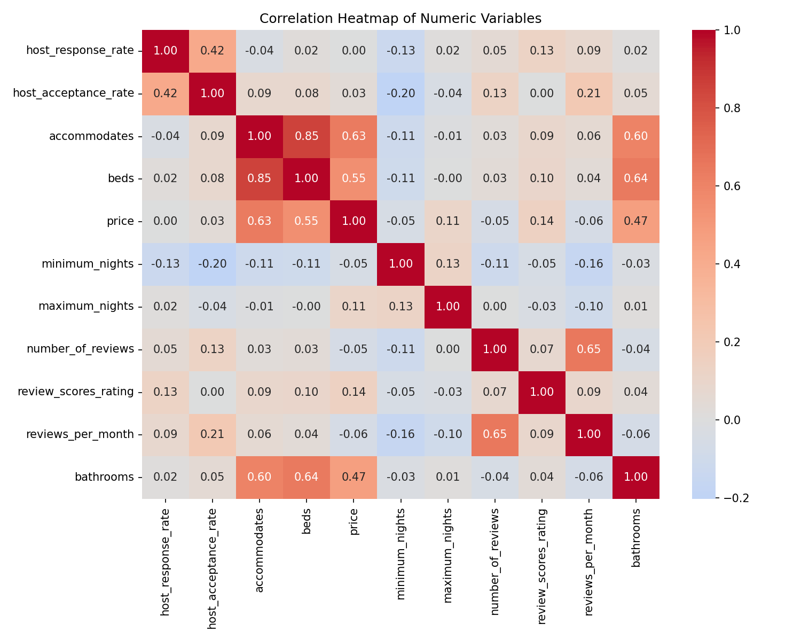
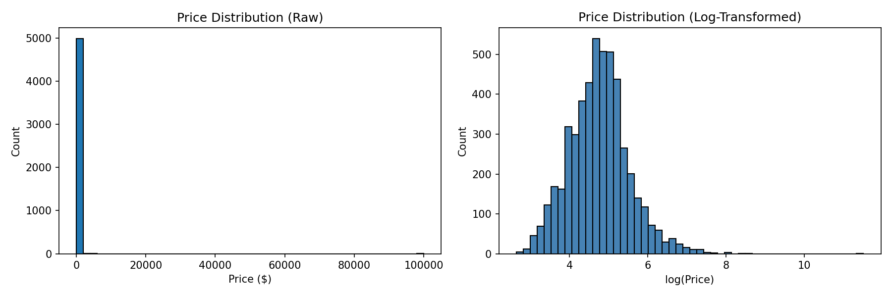
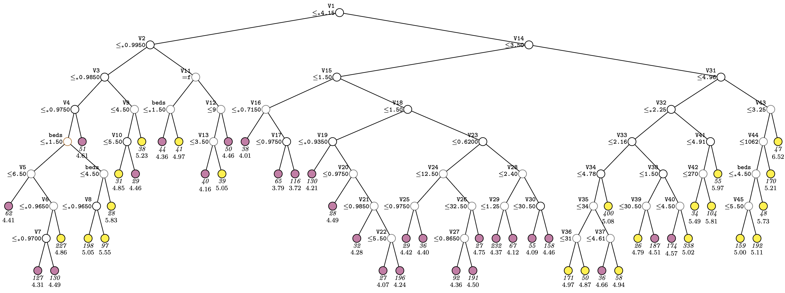
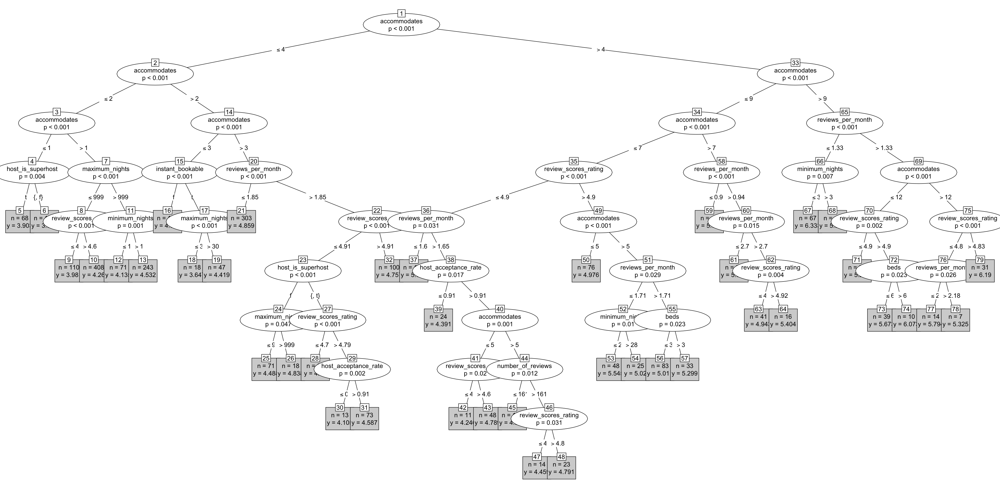
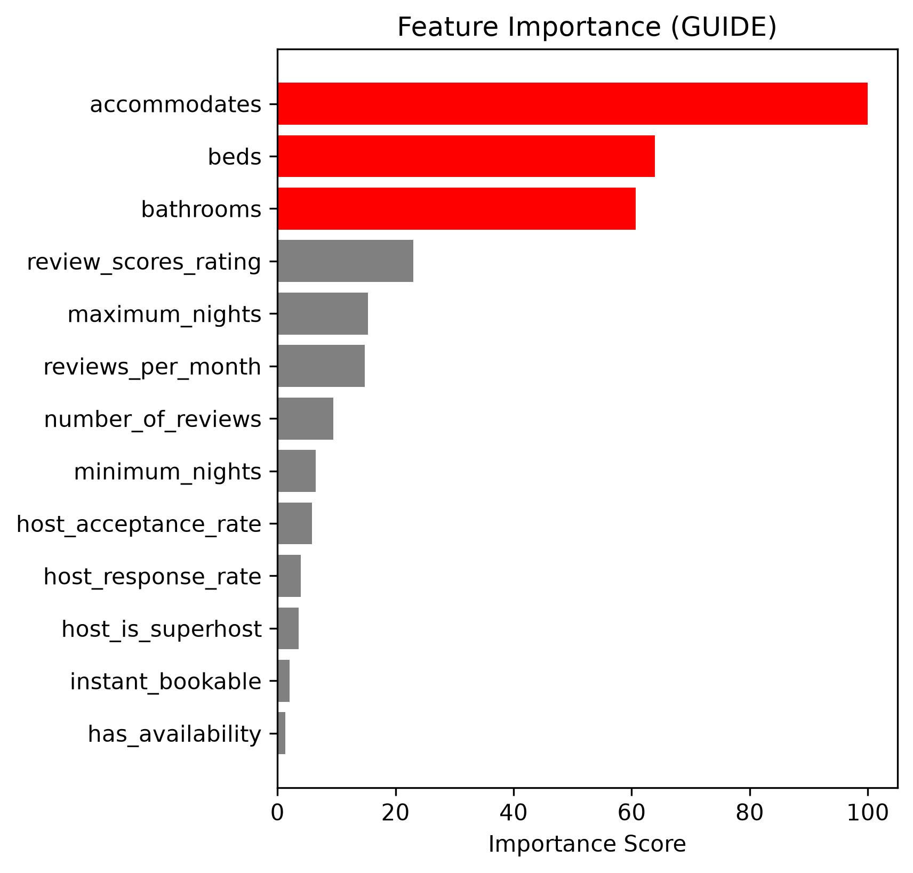
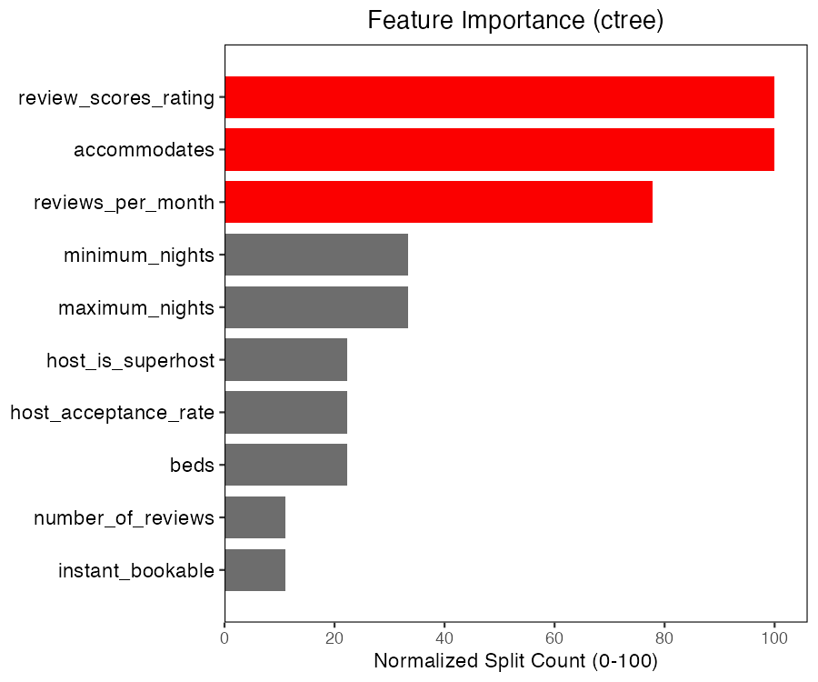
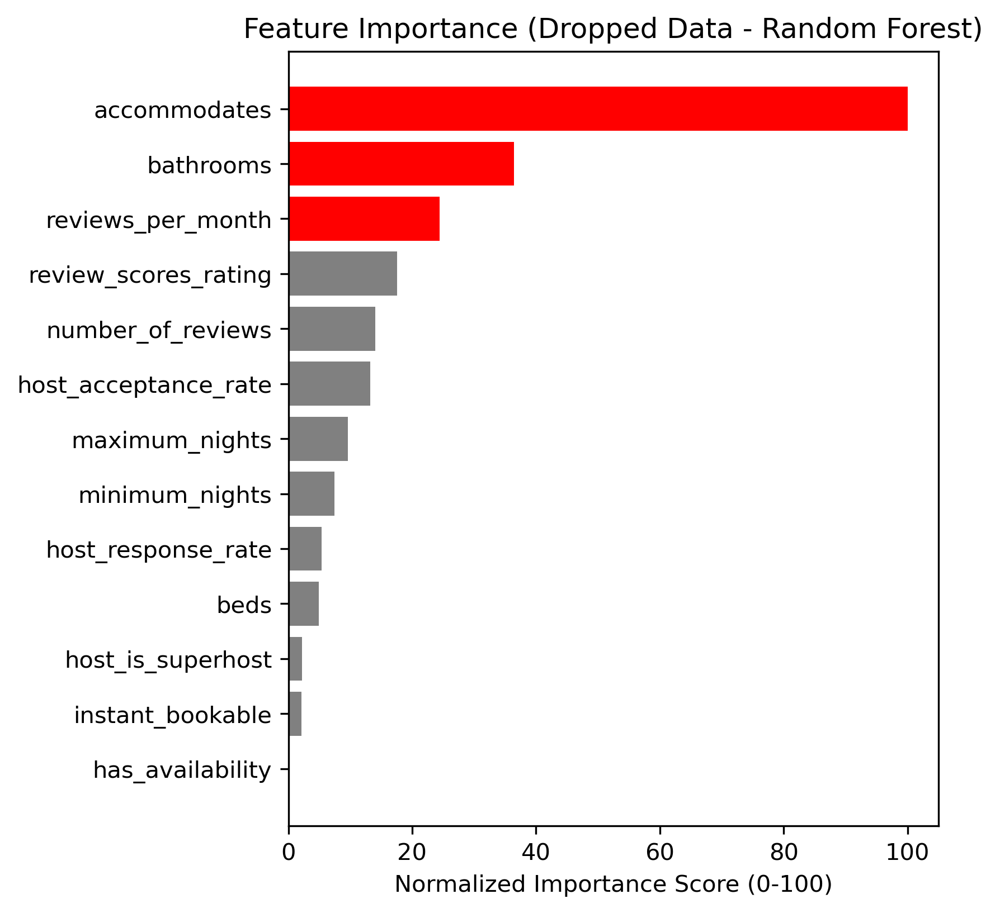
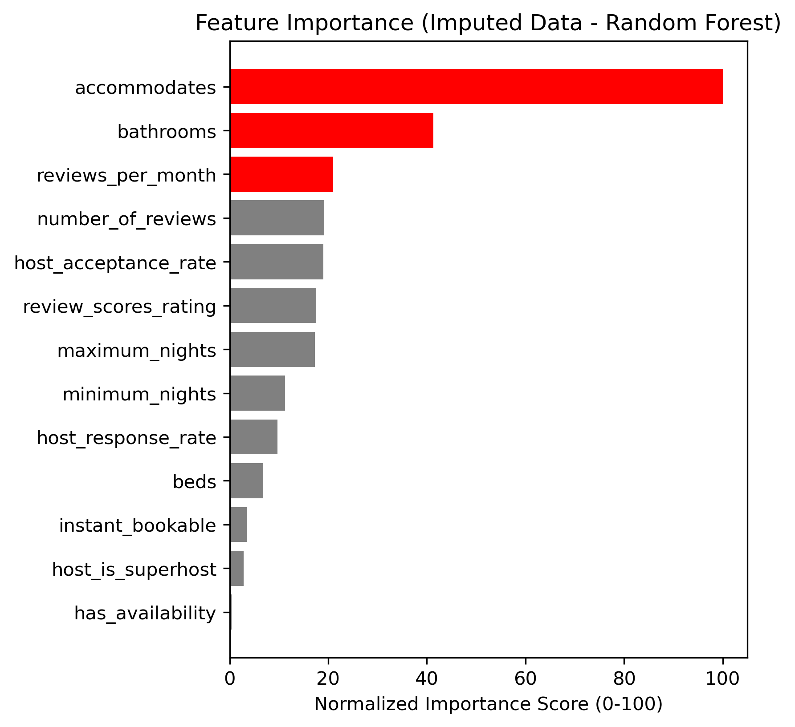

```{r setup, include=FALSE}
knitr::opts_chunk$set(echo = TRUE, warning = FALSE, message = FALSE)
library(patchwork)
library(ggplot2)
```

# 1. Introduction

### 1.1 Work efforts (for grader)

Considerable effort was invested in data preparation, including comprehensive data cleaning, normalization, and transformation. A significant component of this work involved developing reusable Python utilities to streamline the process of exporting datasets into GUIDE-compatible formats, making the workflow reproducible and applicable to other datasets.

Another source of effort is my implemententation of a multi-method validation strategy encompassing five distinct approaches: GUIDE regression trees, conditional inference trees (ctree), linear regression (serving as a baseline in Python), random forest with complete case analysis (dropping missing values), and random forest with mean imputation. This comprehensive comparison allowed me to assess consistency across different algorithms, programming environments, and missing data handling strategies.

Additionally, these results had to be evaluated for its worth, and I made sure to go into detail about the differences and value of each model I used. 

### 1.2 Abstract

**Note:** This abstract has the sections it is referring to of my report in parenthesis, and the table of contents should allow ease of move to the section of interest. 

This report analyzes Airbnb listing prices to determine which listing characteristics are most influential in predicting price and whether those conclusions are consistent across several modeling approaches. The analysis focuses on the GUIDE regression tree algorithm as the primary method and compares its results with a conditional inference tree fit in R and several models trained independently in Python. Because Airbnb prices are shaped by a combination of listing size, amenities, host behavior, booking restrictions, and review-related information, this project asks whether different methods identify the same variables as the main drivers of price.

Before modeling, exploratory visualizations were used to identify potential predictors and understand the structure of the data (2). Box plots and scatter plots revealed a clear positive relationship between listing capacity and price, with accommodates, beds, and bathrooms all showing consistent upward trends. By contrast, superhost status and availability showed weaker or less consistent associations with price, suggesting that listing characteristics matter more than host reputation in determining price.

The dataset was obtained from Kaggle and contains Airbnb listing information such as accommodation capacity, bed and bathroom counts, availability measures, host response and acceptance rates, and review statistics. Before modeling, the data were preprocessed in Python to convert percentage variables into numeric form, recode boolean fields, transform `bathrooms_text` into a numeric bathroom measure, and log-transform the response variable `price` (3.1). The log transformation was used because the raw price distribution was strongly right-skewed and contained extreme outliers that would otherwise dominate the analysis (2.1). Missing values were also an important feature of the dataset, so part of the project involved comparing how different modeling approaches behaved under different missing-data strategies (7.3-7.4). To facilitate the GUIDE analysis, reusable Python utilities were developed to export the cleaned dataset into GUIDE-compatible .txt and .dsc files, making the preprocessing workflow reproducible (3.2).

The main model in the report is a least-squares regression tree fit using GUIDE v4.6.1 (4.1). GUIDE was chosen because it is specifically designed for classification and regression trees with statistically motivated split selection, built-in handling of missing predictor values, and interpretable variable importance scoring. The GUIDE model was fit on 5,000 training observations with `log(price)` as the response. The final tree contained 50 terminal nodes and explained 72.24% of the variance in the training data (4.2). In the fitted tree, `review_scores_rating` appeared as the root split variable, meaning it gave the strongest initial partition of the data (5.1), while the GUIDE importance table identified `accommodates`, `beds`, and `bathrooms` as the most influential predictors when contribution across the full tree was aggregated (8.2).

To evaluate whether these findings were specific to GUIDE or reflected a broader pattern in the data, three additional models were fit in Python using scikit-learn (7.1): a linear regression baseline, a random forest trained on complete cases after dropping missing values, and a second random forest trained after mean imputation so that more observations could be retained. These Python models were evaluated using an 80/20 train-test split with random seed 42, and 10-fold cross-validation was used to assess stability. The linear regression model achieved an out-of-sample R2 of approximately 0.45, indicating that a simple linear specification was not flexible enough to capture the full structure of the data (7.2). Both random forest models performed substantially better, with test-set R2 values around 0.64 to 0.65 and cross-validated scores of similar magnitude (7.3-7.4). The close agreement between the dropped-data and imputed-data random forests suggests that the treatment of missing values does not substantially change the main conclusions about predictive structure (9.2). It is worth noting that GUIDE's R2 of 0.72 is not directly comparable to the held-out test scores from the Python models (7.5).

To further compare GUIDE with another statistically based tree method, a conditional inference tree (ctree) was fit in R on complete cases only, as ctree does not handle missing values natively (6.1). Like GUIDE, ctree uses permutation-based statistical testing to determine splits, making it a natural methodological comparison. Because ctree does not provide the same kind of variable importance score as GUIDE or random forest, importance was approximated by counting how often each variable appeared as a split variable throughout the tree (8.3). The ctree analysis identified `accommodates` and `review_scores_rating` as the most frequently used split variables, and all splits in the fitted tree were statistically significant under the default criterion (6.3). Although the ctree model produced a smaller tree than GUIDE (6.5), it reinforced the same overall message about which variables matter most.

RMSE was also used to compare prediction error more directly. Because the response variable was log-transformed, RMSE was first interpreted on the log(price) scale and then converted into approximate dollar errors using the median listing price of $115. The random forest models had the lowest RMSE values, indicating the strongest predictive accuracy, while GUIDE and ctree had similar intermediate errors and linear regression performed worst (10.1). This supports the broader interpretation that flexible tree-based ensemble methods predict Airbnb prices best, while GUIDE and ctree remain valuable because they provide more interpretable tree structures and clearer variable-level explanations (10.2).

Across GUIDE, ctree, and both random forest models, `accommodates` consistently emerged as the strongest predictor of Airbnb price (9.3). GUIDE also placed substantial emphasis on `beds` and `bathrooms` (8.2), while the random forest models highlighted `bathrooms`, `reviews_per_month`, and `review_scores_rating` (8.4-8.5). The ctree results similarly emphasized `accommodates`, `review_scores_rating`, and `reviews_per_month` (8.3). RMSE results added a direct prediction-error comparison: the random forest models produced the lowest errors, while GUIDE and ctree had similar intermediate errors and linear regression performed worst (10). Rather than treating differences between models as contradictions, the analysis examines why each method behaves differently, especially how tree-based methods, ensemble methods, and linear models handle correlated predictors, nonlinear relationships, and interaction effects (9.4-10). Taken together, these findings indicate that Airbnb pricing in this dataset is driven primarily by listing capacity and related structural characteristics, with review-based measures playing an important supporting role. Overall, the broad agreement among methods suggests that the main conclusions are robust rather than artifacts of one specific algorithm.

### 1.3 Key Findings

1. **Capacity is king**: Accommodates, beds, and bathrooms are the strongest predictors across all methods
2. **Reviews matter, but less**: Review scores and frequency play supporting roles
3. **Missing data strategy doesn't change conclusions**: Dropping vs. imputation yielded similar results
4. **Log transformation was essential**: Raw prices were too skewed for effective modeling

### 1.4 Project goals
The goal of this project is to use the GUIDE algorithm to identify important predictors of Airbnb listing prices and to compare these results with models trained independently using Python.

**Research question:** Which variables are most influential in determining Airbnb listing price, and do GUIDE and other modeling approaches agree on their relative importance?

# 2. Data Visualization

### 2.1 Data 

To better understand how listing characteristics relate to price, several exploratory plots are presented below. The data shown here have already been cleaned for visualization; details of the preprocessing steps are provided in the next section.

```{r, include=FALSE}
df <- read.csv("data/train_regression.csv")
df$price <- as.numeric(gsub("[$, ]", "", df$price))
df$bathrooms <- as.numeric(gsub("[^0-9.]", "", df$bathrooms_text))
df$host_response_rate <- as.numeric(gsub("%", "", df$host_response_rate))
df$host_acceptance_rate <- as.numeric(gsub("%", "", df$host_acceptance_rate))
df$host_is_superhost <- ifelse(df$host_is_superhost == "t", 1, 0)
df$instant_bookable <- ifelse(df$instant_bookable == "t", 1, 0)

df_no_na_beds <- df[!is.na(df$beds), ]
df_no_na_bath <- df[!is.na(df$bathrooms), ]
```

```{r, echo=FALSE, fig.width=14, fig.height=10}
p1 <- ggplot(df, aes(x = room_type, y = log(price), fill = room_type)) +
  geom_boxplot() +
  scale_fill_brewer(palette = "Set1") +
  labs(title = "Log Price by Room Type",
       x = "Room Type",
       y = "Log(Price)") +
  theme_minimal(base_size = 14) +
  theme(legend.position = "none")

p2 <- ggplot(df, aes(x = availability_365, y = log(price))) +
  geom_point(color = "black", alpha = 0.1) +
  labs(title = "Availability vs Log Price",
       x = "Availability (days/year)",
       y = "Log(Price)") +
  theme_minimal(base_size = 14)

p3 <- ggplot(df, aes(x = factor(host_is_superhost,
                               levels = c(0, 1),
                               labels = c("Not superhost", "Superhost")),
                     y = log(price),
                     fill = factor(host_is_superhost))) +
  geom_boxplot() +
  scale_fill_brewer(palette = "Set1") +
  labs(title = "Log Price by Superhost Status",
       x = "Superhost",
       y = "Log(Price)") +
  theme_minimal(base_size = 14) +
  theme(legend.position = "none")

p4 <- ggplot(df, aes(x = factor(accommodates), y = log(price))) +
  geom_boxplot(fill = "steelblue") +
  labs(title = "Log Price by Number of Guests (Accommodates)",
       x = "Accommodates",
       y = "Log(Price)") +
  theme_minimal(base_size = 14) 

p5 <- ggplot(df_no_na_bath, aes(x = factor(bathrooms), y = log(price))) +
  geom_boxplot(fill = "steelblue") +
  labs(title = "Log Price by Number of Bathrooms",
       x = "Bathrooms",
       y = "Log(Price)") +
  theme_minimal(base_size = 14) +
  theme(axis.text.x = element_text(angle = 45, hjust = 1))

p6 <- ggplot(df_no_na_beds, aes(x = factor(beds), y = log(price))) +
  geom_boxplot(fill = "steelblue") +
  labs(title = "Log Price by Number of Beds",
       x = "Beds",
       y = "Log(Price)") +
  theme_minimal(base_size = 14) +
  theme(axis.text.x = element_text(angle = 45, hjust = 1))

(p1 | p2) /
(p3 | p4) /
(p5 | p6)
```


### 2.2 Initial interpretation

These initial observations help identify potential key predictors, which will be examined more rigorously in subsequent modeling.

**Room Type vs Price:** Listings categorized as entire homes tend to have higher prices than private or shared rooms. This indicates that room type is a major structural driver of pricing, with guests paying a premium for full property access.

**Availability vs Price:** The vertical clustering reflects the discrete nature of availability, as many listings share similar availability levels. Listings with very low availability are likely frequently booked, while those with high availability may reflect lower demand or inactive listings. Overall, availability does not show a strong direct relationship with price.

**Superhost Status:** Superhost status shows only minor differences in price distributions. While superhosts may have slightly higher prices on average, the effect is relatively small compared to listing characteristics, suggesting that reputation plays a secondary role in pricing.

**Accommodates:** A clear positive relationship is observed between accommodates and price, with listings that host more guests consistently associated with higher prices. This supports its role as the most important predictor identified in both the GUIDE and random forest models.

**Bathrooms:** Listings with more bathrooms tend to have higher prices, reinforcing the importance of property size and amenities in pricing.

**Beds:** A positive relationship is observed between beds and price, though the effect overlaps with accommodates and bathrooms, indicating these variables capture similar aspects of listing size. 

# 3. Data preparation

### 3.1 Preparation and setup

The Airbnb dataset used for this analysis was obtained from Kaggle and imported into Python using the `kagglehub` package. The training data was loaded into a pandas DataFrame for preprocessing and exploratory inspection.

<div style="display: flex; gap: 20px; align-items: flex-start;">
<div>
A subset of variables relevant to pricing was selected for regression tree modeling, including host characteristics, listing capacity, availability, and review information. These were chosen to reflect key factors influencing prices, while excluding identifiers and redundant columns.

The selected variables were:

- host_response_rate  
- host_acceptance_rate  
- host_is_superhost  
- accommodates  
- bathrooms_text  
- beds  
- price  
- minimum_nights  
- maximum_nights  
- has_availability  
- number_of_reviews  
- review_scores_rating  
- instant_bookable  
- reviews_per_month  
</div>
<div style="flex: 1;">

<div style="width: 550px; flex-shrink: 0;">
```{r, out.width="100%", echo=FALSE}

```

</div>

<small>*The correlation heatmap highlights strong relationships between `accommodates`, `beds`, and `bathrooms`, suggesting multicollinearity among capacity-related variables.*</small>

</div>
</div>

Missing values were examined across all variables to understand the degree of incomplete data. Rather than manually imputing missing values, GUIDE’s built-in missing value handling procedure was used. GUIDE allows observations with incomplete predictor information to remain in the analysis. This is important because real-world Airbnb listings often contain missing information, and potential guests may incorporate that missingness into their booking decisions.

Some variables required transformation before analysis. In particular, the variable `bathrooms_text`, which is stored as a textual description (e.g., "1 bath", "2 baths"), was converted into a numeric variable representing the number of bathrooms.

Price was log-transformed to reduce the influence of extreme outliers. The dataset contains a small number of listings with unusually high prices, including one priced at $99,998, which is likely a data entry error. Without transformation, such values would disproportionately influence model fitting.

```{r, out.width="100%", echo=FALSE}

```
<small>*The raw price distribution is heavily right-skewed, with a small number of extreme values driving the scale. The log transformation produces a more symmetric distribution, reducing the influence of outliers and making the response variable more suitable for modeling.*</small>
<br><br>

After preprocessing, the cleaned dataset was exported into a space-delimited text file (`airbnb.txt`) and a corresponding descriptor file (`airbnb.dsc`). These files were then used as input for GUIDE to construct a regression tree predicting listing price.

### 3.2 Creating the GUIDE Input Files

To run the regression tree in GUIDE, the cleaned dataset must be exported into two files:

- `airbnb.txt` : the dataset used by GUIDE  
- `airbnb.dsc` : a descriptor file defining the variables and their types  

The `.txt` file was created by exporting the cleaned DataFrame as a space-delimited file. Missing values were replaced with `"NA"` to match the missing-value indicator expected by GUIDE.

```python
# Replace missing values with GUIDE missing indicator
setup_df = clean_df.fillna("NA")

# Export dataset for GUIDE
setup_df.to_csv(
    "airbnb.txt",
    sep=" ",
    index=False,
    header=True
)
```

The descriptor file (`.dsc`) was then generated automatically to ensure that the variable names and types matched the dataset exactly. GUIDE requires each variable to be labeled according to its role:

- `d` = dependent variable (target variable)  
- `n` = numeric predictor  
- `b` = categorical predictor  

The following Python code was used to assign the appropriate variable types and write the descriptor file:

```python
dsc_filename = "airbnb.dsc"
data_filename = "airbnb.txt"

lines = []
target_column = "price"

for i, col in enumerate(clean_df.columns, start=1):

    if col == target_column:
        var_type = "d"     # dependent variable

    elif pd.api.types.is_numeric_dtype(clean_df[col]):
        var_type = "n"     # numeric variable

    else:
        var_type = "b"     # categorical variable

    lines.append(f"{i} {col} {var_type}")

with open(dsc_filename, "w") as f:
    f.write(f"{data_filename}\n")
    f.write("NA\n")
    f.write("2\n")
    for line in lines:
        f.write(line + "\n")
```

This script ensures that the `.dsc` file accurately reflects the structure of the cleaned dataset, allowing GUIDE to correctly interpret the predictors and response variable when constructing the regression tree.

---

# 4. Running GUIDE

### 4.1 Settings

The regression tree was constructed using GUIDE v4.6.1, which implements the Generalized, Unbiased Interaction Detection and Estimation (GUIDE) algorithm for building regression and classification trees.

The cleaned dataset (`airbnb.txt`) and descriptor file (`airbnb.dsc`) were loaded into GUIDE. The variable **price** was specified as the dependent variable, while all remaining variables were treated as predictors. The response variable price was transformed using log(price) to reduce the effect of extreme values. Airbnb prices tend to be highly right-skewed, with a small number of very expensive listings. Applying a logarithmic transformation reduces skewness and allows the model to capture proportional differences in price more effectively.

A **least-squares regression tree** was used, meaning that GUIDE fit a regression tree under a least-squares criterion while using its own statistically motivated split-selection procedure and cross-validation pruning. GUIDE automatically evaluates candidate splits and prunes the tree using **cross-validation** to prevent overfitting. The pruning step used 10-fold cross-validation, meaning that the training data was partitioned into ten subsets. The model was repeatedly trained on nine subsets and evaluated on the remaining subset, allowing GUIDE to estimate prediction error and select the optimal tree size. Missing predictor values are handled automatically by GUIDE through imputation combined with missing-value indicator variables during tree construction.

The training dataset used for the tree contained **5,000 observations**, with predictors describing listing characteristics, host behavior, and review information.

### 4.2 Results
```{r, out.width="100%", echo=FALSE}

```

**Figure notes** (Colored separately to show matching predictors)
<div style="column-count: 3; column-gap: 40px;">
- V1 = <span style="color:blue">review_scores_rating</span>   
- V2 = <span style="color:purple">host_acceptance_rate</span>  
- V3 = <span style="color:purple">host_acceptance_rate</span>  
- V4 = <span style="color:purple">host_acceptance_rate</span>  
- V5 = <span style="color:green">minimum_nights</span>  
- V6 = <span style="color:purple">host_acceptance_rate</span>  
- V7 = host_response_rate  
- V8 = <span style="color:purple">host_acceptance_rate</span>  
- V9 = <span style="color:orange">accommodates</span>  
- V10 = <span style="color:green">minimum_nights</span>  
- V11 = instant_bookable  
- V12 = <span style="color:green">minimum_nights</span>  
- V13 = <span style="color:orange">accommodates</span>  
- V14 = <span style="color:orange">accommodates</span>  
- V15 = <span style="color:orange">accommodates</span>  
- V16 = <span style="color:purple">host_acceptance_rate</span>  
- V17 = <span style="color:purple">host_acceptance_rate</span>  
- V18 = <span style="color:green">minimum_nights</span>  
- V19 = <span style="color:purple">host_acceptance_rate</span>  
- V20 = <span style="color:purple">host_acceptance_rate</span>  
- V21 = <span style="color:purple">host_acceptance_rate</span>  
- V22 = <span style="color:red">number_of_reviews</span>  
- V23 = <span style="color:goldenrod">reviews_per_month</span>  
- V24 = <span style="color:green">minimum_nights</span>  
- V25 = <span style="color:purple">host_acceptance_rate</span>  
- V26 = <span style="color:green">minimum_nights</span>  
- V27 = <span style="color:purple">host_acceptance_rate</span>  
- V28 = <span style="color:goldenrod">reviews_per_month</span>  
- V29 = bathrooms  
- V30 = maximum_nights  
- V31 = <span style="color:blue">review_scores_rating</span>   
- V32 = bathrooms  
- V33 = <span style="color:goldenrod">reviews_per_month</span>  
- V34 = <span style="color:blue">review_scores_rating</span>  
- V35 = <span style="color:red">number_of_reviews</span>  
- V36 = <span style="color:green">minimum_nights</span>  
- V37 = <span style="color:blue">review_scores_rating</span>  
- V38 = <span style="color:green">minimum_nights</span>  
- V39 = maximum_nights  
- V40 = <span style="color:orange">accommodates</span>  
- V41 = <span style="color:blue">review_scores_rating</span>  
- V42 = maximum_nights  
- V43 = bathrooms  
- V44 = maximum_nights  
- V45 = <span style="color:red">number_of_reviews</span>  
</div>
**Additional notes:**

- Splits at nodes drawn with **gray circles** are not statistically significant.  
- Splits at nodes drawn with **brown circles** represent interaction splits.  
- Sample size (in italics) and mean price are printed below nodes.  
- Terminal nodes with means **above 4.76 at the root node are colored yellow**, and those **below are colored purple**.  
- The second-best split variable at the root node is **accommodates**.

**R-squared explained by tree model:** 0.7224  
**Final tree size:** 50 terminal nodes, 99 total nodes. Reflects a moderately complex model that balances predictive accuracy with interpretability.

A smaller tree would be easier to interpret at a glance, but would sacrifice the granularity needed to capture the complex interactions between listing capacity, host behavior, and review characteristics that drive Airbnb pricing. The 50-node structure reflects a deliberate tradeoff: enough complexity to meaningfully partition the data, while remaining interpretable at the level of individual paths through the tree.

**RMSE results:**

* GUIDE CV MSE = 0.2738
* GUIDE CV RMSE = sqrt(0.2738) = 0.5232590181

---

# 5. GUIDE Interpretation

### 5.1 Root Split

The regression tree identifies **`review_scores_rating`** as the first split, indicating that it explains the largest initial variation in listing price. This variable appears at the **root node**, meaning it explains the largest variation in price within the dataset.

Listings with **lower review scores** follow the left branch of the tree, while listings with **higher review scores** follow the right branch. This suggests that listings with stronger guest ratings tend to have higher predicted prices.

It is worth noting that the majority of splits in the tree are drawn with gray circles, indicating that they are not statistically significant. This does not mean the splits are uninformative, as GUIDE still uses them to reduce prediction error, but it suggests that the partitioning is driven more by predictive performance than by statistically detectable differences between groups.

The fact that the GUIDE model explains 72.24% of the variance in log(price) suggests that, despite the lack of statistical significance at most splits, the tree retains strong predictive power. This further supports the interpretation that the splits are meaningful in a practical sense, even if they do not meet formal significance thresholds.

### 5.2 Other Important Predictors

Several additional variables appear frequently throughout the tree and help refine price predictions:

- **host_acceptance_rate:** reflects host responsiveness and booking behavior  
- **accommodates:** captures the capacity of the listing  
- **minimum_nights:** distinguishes between short-term and longer required stays  
- **number_of_reviews:** indicates listing popularity and user engagement  
- **reviews_per_month:** captures recent review activity and likely reflects listing demand, visibility, and booking frequency.

For example, splits on accommodates show that listings that can host more guests tend to have higher predicted prices. Similarly, minimum_nights separates listings designed for short stays from those requiring longer bookings.

### 5.3 Terminal Node Interpretation

The terminal nodes of the tree are colored based on whether their predicted **mean log(price)** is above or below the overall mean value at the root node (4.76). Each node in the regression tree reports the sample size of listings contained in that node and the mean value of the response variable for that group. Because the response variable was transformed using log(price), the values shown in the nodes represent the average log-price of listings within that subgroup rather than the raw price. This transformation allows the model to capture relative differences in price while reducing the influence of extreme outliers.

- **Yellow nodes** represent groups of listings with predicted prices above the overall average.
- **Purple nodes** represent groups of listings with predicted prices below the overall average.

This color scheme helps visually identify which combinations of listing characteristics correspond to relatively higher or lower predicted prices.

--- 

# 6. R-Based Validation: ctree

### 6.1 Setup and results

To provide a more methodologically comparable alternative to GUIDE, a conditional inference tree was fit in R using the ctree function from the party package. Like GUIDE, ctree uses permutation-based statistical tests to select split variables at each node, rather than greedily minimizing a loss function. The same preprocessed dataset used for GUIDE was loaded and prepared in R. Boolean columns were converted to factors, and rows with missing values were dropped to satisfy ctree's input requirements, meaning ctree was trained on complete cases only.

```{r ctree-setup, message=FALSE, warning=FALSE, echo=FALSE}
library(party)
library(dplyr)

airbnb <- read.csv("./data/train_regression.csv", stringsAsFactors = FALSE)

cols_to_keep <- c(
  "host_response_rate", "host_acceptance_rate", "host_is_superhost",
  "accommodates", "beds", "price", "minimum_nights", "maximum_nights",
  "has_availability", "number_of_reviews", "review_scores_rating",
  "instant_bookable", "reviews_per_month"
)

df_r <- airbnb[, cols_to_keep]

df_r$price <- as.numeric(gsub("[$,]", "", df_r$price))
df_r$price <- log(df_r$price)

df_r$host_response_rate  <- as.numeric(gsub("%", "", df_r$host_response_rate))  / 100
df_r$host_acceptance_rate <- as.numeric(gsub("%", "", df_r$host_acceptance_rate)) / 100

bool_cols <- c("host_is_superhost", "has_availability", "instant_bookable")
df_r[bool_cols] <- lapply(df_r[bool_cols], as.factor)

df_r <- na.omit(df_r)

set.seed(42)
n <- nrow(df_r)
train_idx <- sample(seq_len(n), size = floor(0.8 * n))
train_r <- df_r[ train_idx, ]
test_r  <- df_r[-train_idx, ]
```

```{r ctree-fit, message=FALSE, warning=FALSE, echo=FALSE}
ct <- ctree(price ~ ., data = train_r)

extract_splits <- function(node) {
  if (is.null(node$psplit)) return(character(0))
  c(node$psplit$variableName,
    extract_splits(node$left),
    extract_splits(node$right))
}

used_vars <- extract_splits(ct@tree)
importance_ct <- sort(table(used_vars), decreasing = TRUE)

imp_df <- as.data.frame(importance_ct)
colnames(imp_df) <- c("Variable", "Count")
imp_df$Normalized <- (imp_df$Count / max(imp_df$Count)) * 100
imp_df <- imp_df[order(imp_df$Normalized), ]

top_k <- 3
imp_df$Color <- ifelse(
  imp_df$Normalized >= sort(imp_df$Normalized, decreasing = TRUE)[top_k],
  rgb(251, 0, 0, maxColorValue = 255),
  rgb(109, 109, 109, maxColorValue = 255)
)

p <- ggplot(imp_df, aes(x = Normalized, y = reorder(Variable, Normalized), fill = Color)) +
  geom_bar(stat = "identity", width = 0.8) +
  scale_fill_identity() +
  scale_x_continuous(expand = expansion(add = c(0, 6)), limits = c(0, 100), breaks = seq(0, 100, 20)) +
  scale_y_discrete(expand = expansion(add = c(1, 1))) +
  labs(
    title = "Feature Importance (ctree)",
    x = "Normalized Split Count (0-100)",
    y = NULL
  ) +
  theme_bw() +
  theme(
    plot.title = element_text(face = "plain", hjust = 0.5),
    panel.border = element_rect(color = "black", fill = NA),
    panel.grid = element_blank(),
    legend.position = "none",
    axis.text.y = element_text(size = 11, color = "black")

  )

ggsave("ctree_feature_importance.png", plot = p, width = 6, height = 5, dpi = 150)

png("ctree_tree.png", width=4000, height=2000, res=150)
plot(ct, type="simple")
invisible(dev.off())
```



**Results:**

The following code was used to calculate the respective R2 and RMSE:

```{r}
ct_pred <- predict(ct, newdata = test_r)
ctree_rmse <- sqrt(mean((test_r$price - ct_pred)^2))
print(paste("ctree RMSE:", ctree_rmse))

ctree_r2 <- 1 - sum((test_r$price - ct_pred)^2) / sum((test_r$price - mean(test_r$price))^2)
print(paste("ctree R2:", ctree_r2))
```

### 6.2 Root Split

The difference in root split between GUIDE (review_scores_rating) and ctree (accommodates) does not indicate disagreement between the models. The root split identifies the single best first partition of the data, which is sensitive to the specific dataset and splitting criterion used. GUIDE and ctree use different split-selection criteria, so different root splits do not necessarily indicate disagreement about which variables matter overall. These are different criteria and can legitimately produce different root splits while still agreeing on the overall importance structure. The fact that both variables appear prominently in both trees (accommodates as GUIDE's top importance score and ctree's root, review_scores_rating as GUIDE's root and tied for top in ctree) suggests both are genuinely influential, with the ordering depending on how "importance" is measured rather than reflecting a true disagreement about which variables matter.

### 6.3 Statistical significance

All splits in the ctree are statistically significant. Unlike GUIDE, where many splits are marked with gray circles to indicate a lack of statistical significance, every split selected by ctree passes the Bonferroni-corrected threshold. This suggests that the variables used in the ctree are not only predictively useful but also statistically supported under a stricter splitting criterion.

### 6.4 Key variables that appear 

The variables `accommodates`, `review_scores_rating`, `reviews_per_month`, `minimum_nights`, and `beds` all appear as split variables, which is broadly consistent with the GUIDE and random forest results.

### 6.5 Tree size 

ctree produced a much smaller tree than GUIDE's 50 terminal nodes, which is expected given its stricter splitting criterion.

---

# 7. Python-Based Validation: Random Forest and Linear Regression

### 7.1 Models used

To verify the results obtained from the GUIDE regression tree, additional models were trained using Python’s scikit-learn library. Specifically, a random forest regressor was fit using the same set of variables used in the GUIDE analysis.

Before fitting the models, the dataset was cleaned by converting categorical boolean variables to numeric values and removing rows containing missing values. The response variable was the log-transformed listing price.

The dataset was split into training and testing sets using an 80/20 split. To ensure proper out-of-sample evaluation, all Python models were assessed on a held-out test set, using a fixed random seed of 42 for reproducibility. A random forest model with 500 trees was then trained to obtain stable estimates of variable importance.

This is the code used to make the train/test split:

```Python
X = df.drop(columns=["price"])
y = df["price"]

X_train, X_test, y_train, y_test = train_test_split(
    X, y, test_size=0.2, random_state=42
)
```

**Note:** Unlike GUIDE, Python's scikit-learn models do not handle missing values natively and require the programmer to address them beforehand. For linear regression, rows with missing values were dropped. For the random forest, both dropping and mean imputation were tested to assess whether the handling strategy affects the results.

### 7.2 Linear Regression (baseline)

A linear regression model was fit as a baseline to assess how well a parametric model explains variation in listing price. Given the nonlinear nature of the data, this model is expected to underperform compared to tree-based methods. Both a train/test split evaluation and a 10-fold cross-validation were used to assess model stability and generalizability. 

```Python
lr = LinearRegression()
lr.fit(X_train, y_train)
print("Linear Regression R2:", lr.score(X_test, y_test))

scores_lr = cross_val_score(lr, X, y, cv=10, scoring="r2")
print("Linear Regression CV R2:", scores_lr.mean())

print("Linear Regression RMSE:", np.sqrt(mean_squared_error(y_test, lr_pred)))
```

**Result (dropped):** 

* Linear Regression R2: 0.4509998021076599
* Linear Regression CV R2: 0.4825519101335665
* Linear Regression RMSE: 0.5444789647314726

**Result (imputed):** 
* Linear Regression R2: 0.4206909757200703
* Linear Regression CV R2: 0.4299991416277166
* Linear Regression RMSE: 0.579664350087535

### 7.3 Random Forest (Dropped NaNs)

A random forest with 500 trees was trained to obtain stable estimates of variable importance. Both a train/test split evaluation and a 10-fold cross-validation were applied to confirm consistency across evaluation methods. 

```Python
rf = RandomForestRegressor(n_estimators=500, random_state=42)
rf.fit(X_train, y_train)
print("Random Forest R2:", rf.score(X_test, y_test))

scores = cross_val_score(rf, X, y, cv=10, scoring="r2")
print("Random Forest CV R2:", scores.mean())

print("Random Forest RMSE:", np.sqrt(mean_squared_error(y_test, rf_pred)))
```

**Result:**

* Random Forest R2: 0.6466300878642877
* Random Forest CV R2: 0.6618993689035436
* Random Forest RMSE: 0.4368271667219001

### 7.4 Random Forest (Imputing NaNs)

A second random forest with 500 trees was then trained after mean imputation of missing values so that the full dataset could be retained. Here is the code for the imputation:

```Python
imputer = SimpleImputer(strategy="mean")
X_train = pd.DataFrame(imputer.fit_transform(X_train), columns=X.columns)
X_test = pd.DataFrame(imputer.transform(X_test), columns=X.columns)
```

Both a train/test split evaluation and a 10-fold cross-validation were again applied to assess consistency across evaluation methods, using the imputed predictor matrix in place of the complete-case version:

```Python
rf = RandomForestRegressor(n_estimators=500, random_state=42)
rf.fit(X_train, y_train)
print("Random Forest R2:", rf.score(X_test, y_test))

scores = cross_val_score(rf, X, y, cv=10, scoring="r2")
print("Random Forest CV R2:", scores.mean())

print("Random Forest RMSE:", np.sqrt(mean_squared_error(y_test, rf_pred)))
```

**Result:**

* Random Forest R2: 0.6395592831929331
* Random Forest CV R2: 0.6460314925799823
* Random Forest RMSE: 0.4572338420299068

### 7.5 Model Result Analysis

Note on model comparability: GUIDE's R2 of 0.72 is a training R2 (labeled "Proportion of variance explained by tree model" in GUIDE's output), while all Python model scores are measured on a held-out test set. These numbers are not directly comparable, and GUIDE's score would likely be lower on unseen data. Rather than treating R2 as a performance ranking across models, this analysis focuses on whether the models agree on which predictors matter most.

**Interpretation of model reliability:**

The linear regression model achieved an R2 of 0.45, and a cross-validated score of 0.48. The consistency between the two scores indicates the model is stable. This score is expected, as a simple linear equation cannot capture the seemingly nonlinear relationships present in the data.

Both random forest models outperformed linear regression substantially. The model trained on dropped NaNs achieved an R2 of 0.65 and a cross-validated score of 0.66, while the model trained on imputed NaNs achieved an R2 of 0.64 and a cross-validated score of 0.65. Both show strong consistency between evaluation methods, and the near-identical performance between the two random forests suggests that mean imputation introduces minimal distortion. The additional approximate 1,000 rows retained through imputation did not meaningfully hurt predictive accuracy.

--- 

# 8. Importance calculations

### 8.1 Normalize Scores

To enable a fair visual comparison between GUIDE and Random Forest importance scores, both are normalized to a 0–100 scale by dividing each score by its maximum value. In the graphs, the top 3 importance scores were highlighted in red. 

### 8.2 GUIDE importance

GUIDE also provides a variable importance ranking that measures how strongly each predictor contributes to explaining variation in the response variable. Higher scores indicate variables that are more influential in determining listing price. 

<div style="display: flex; gap: 15px; align-items: flex-start;">
  <div style="min-width: 0; width: 55%; font-family: monospace; font-size: 0.85em; overflow: hidden;" markdown="1">
    
  | Score | Normalized | Variable |
  |------:|-----------:|:---------|
  | **106.60** | **100.00** | **accommodates** |
  | **68.16** | **63.94** | **beds** |
  | **64.72** | **60.71** | **bathrooms** |
  | 24.53 | 23.01 | review_scores_rating |
  | 16.35 | 15.34 | maximum_nights |
  | 15.78 | 14.80 | reviews_per_month |
  | 10.12 | 9.49 | number_of_reviews |
  | 6.90 | 6.47 | minimum_nights |
  | 6.25 | 5.86 | host_acceptance_rate |
  | 4.24 | 3.98 | host_response_rate |
  | 3.82 | 3.58 | host_is_superhost |
  | 2.22 | 2.09 | instant_bookable |
  | 1.47 | 1.38 | has_availability |
  
  </div>
  
  <div style="min-width: 0; width: 45%;">
  
  </div>
</div>

**Note:** `review_scores_rating` is ranked fourth in GUIDE's overall importance table. GUIDE's importance score reflects a variable's cumulative contribution across the entire tree, whereas the root split identifies the single variable that provides the strongest first partition of the data. `accommodates` ranks first overall because it appears repeatedly throughout the tree, while `review_scores_rating` provides the strongest initial split. In other words, these measures capture different aspects of model importance.

**Implementation note:** I created a simple Python script to read the data as is from the txt file generated by GUIDE, allowing me to graph it later:

```Python
# Read the file (fixed-width format)
df = pd.read_fwf("importance.txt")

# Convert Score from scientific notation to float (just in case)
df["Score"] = df["Score"].astype(float)
```

### 8.3 ctree importance

A conditional inference tree was then fit on the training data using default settings, which apply a Bonferroni-corrected permutation test at each node to determine whether a split is warranted. Because `ctree` does not produce a single numeric importance score like Random Forest, variable importance is approximated by counting how many times each variable is selected as a split variable across all internal nodes.

**Result:**
<div style="display: flex; gap: 30px; align-items: flex-start;">
  <div style="min-width: 0; width: 55%; font-family: monospace; font-size: 0.85em; overflow: hidden;" markdown="1">

  | Variable | Split Count | Normalized |
  |:---------|----------:|-----------:|
  | **accommodates** | **9** | **100.0** |
  | **review_scores_rating** | **9** | **100.0** |
  | **reviews_per_month** | **7** | **77.8** |
  | minimum_nights | 3 | 33.3 |
  | maximum_nights | 3 | 33.3 |
  | beds | 2 | 22.2 |
  | host_acceptance_rate | 2 | 22.2 |
  | host_is_superhost | 2 | 22.2 |
  | instant_bookable | 1 | 11.1 |
  | number_of_reviews | 1 | 11.1 |

  </div>
  <div style="min-width: 0; width: 45%;">
  
  </div>
</div>

### 8.4 Random Forest Importance (Dropped)

After calculating the values, RF allows for its importances to be exported with code similar to this:

```Python
importance_df["Normalized"] = (importance_df["Score"] / importance_df["Score"].max()) * 100
print(importance_df[["Variable", "Score", "Normalized"]].sort_values("Score", ascending=False))
```
**Result:**

<div style="display: flex; gap: 30px; align-items: flex-start;">
  <div style="min-width: 0; width: 45%; font-family: monospace; font-size: 0.85em; overflow: hidden;" markdown="1">

  | Variable | Score | Normalized |
  |:---------|----------:|-----------:|
  | **accommodates** | **0.421** | **100.00** |
  | **bathrooms** | **0.153** | **36.42** |
  | **reviews_per_month** | **0.103** | **24.40** |
  | review_scores_rating | 0.074 | 17.61 |
  | number_of_reviews | 0.059 | 14.04 |
  | host_acceptance_rate | 0.056 | 13.26 |
  | maximum_nights | 0.041 | 9.62 |
  | minimum_nights | 0.031 | 7.40 |
  | host_response_rate | 0.023 | 5.42 |
  | beds | 0.021 | 4.91 |
  | host_is_superhost | 0.009 | 2.20 |
  | instant_bookable | 0.009 | 2.15 |
  | has_availability | 0.000 | 0.00 |
  
  </div>
  
  <div style="min-width: 0; width: 55%;">
  
  </div>
</div>

### 8.5 Random Forest Importance (Imputed)

Calculating the importance is done the same way as earlier with the dropped-data Random Forest:

```Python
importance_df["Normalized"] = (importance_df["Score"] / importance_df["Score"].max()) * 100
print(importance_df[["Variable", "Score", "Normalized"]].sort_values("Score", ascending=False))
```

**Result:**

<div style="display: flex; gap: 30px; align-items: flex-start;">
  <div style="min-width: 0; width: 45%; font-family: monospace; font-size: 0.85em; overflow: hidden;" markdown="1">

  | Variable | Score | Normalized |
  |:---------|----------:|-----------:|
  | **accommodates** | **0.371** | **100.00** |
  | **bathrooms** | **0.153** | **41.26** |
  | **reviews_per_month** | **0.078** | **21.01** |
  | number_of_reviews | 0.071 | 19.22 |
  | host_acceptance_rate | 0.070 | 19.01 |
  | review_scores_rating | 0.065 | 17.50 |
  | maximum_nights | 0.064 | 17.35 |
  | minimum_nights | 0.041 | 11.13 |
  | host_response_rate | 0.036 | 9.71 |
  | beds | 0.025 | 6.87 |
  | instant_bookable | 0.013 | 3.49 |
  | host_is_superhost | 0.011 | 2.91 |
  | has_availability | 0.001 | 0.39 |

  </div>
  
  <div style="min-width: 0; width: 55%;">
  
  </div>
</div>

---

# 9. Variable Importance: Cross-Method Comparison

### 9.1 Comparison between GUIDE and ctree

The only variable that appears in the top three for both GUIDE and ctree is `accommodates`, which ranks first in both. Beyond that, the rankings diverge: GUIDE places more emphasis on structural listing features such as `beds` and `bathrooms`, whereas ctree gives more weight to review-related variables such as `review_scores_rating` and `reviews_per_month`. This difference is partly methodological. GUIDE's importance score reflects how much each split reduces prediction error, whereas the ctree comparison is based on split frequency across the tree. As a result, the two rankings are informative but not directly equivalent.

### 9.2 Comparison between dropped and imputed

The top three variables are identical in both (minus some changes in scoring), and accommodates is by far the most important in both cases. The main differences are:

* `accommodates` declines from 0.421 to 0.371, making it slightly less dominant after imputation.
* `bathrooms`' normalized score rises from 36.42 to 41.26, making it relatively more important as `accommodates` weakens.
* `reviews_per_month` becomes less important, falling from 0.103 to 0.078.
* `maximum_nights` moves from 7th to 5th, into the cluster of mid-ranked variables.
* `has_availability` increases from 0.000 to 0.001, which is still effectively zero but suggests that imputation recovers a negligible amount of signal.

Overall, the ranking shifts are minor and mostly confined to the middle of the importance table. The leading predictors remain the same, and the lower-ranked variables are nearly unchanged across the two models. This small amount of reshuffling is expected when several predictors have very similar scores. Substantively, both models tell the same story: the choice between dropping and imputing missing values has little effect on the main conclusions drawn from variable importance.

### 9.3 Comparison between GUIDE and Random Forest 

Across GUIDE and both random forest models, **accommodates** is the most important predictor of price.

Structural listing characteristics also matter consistently. `bathrooms` and `beds` rank highly in GUIDE, and although `beds` is less prominent in the random forest models, both approaches still point to listing size and layout as important drivers of price.

Review-related variables such as `review_scores_rating`, `reviews_per_month`, and `number_of_reviews` also appear among the important predictors across models. These variables likely capture guest satisfaction, listing visibility, and demand, all of which can affect pricing.

Although the exact rankings differ somewhat between GUIDE and random forest, the overlap in the leading predictors is substantial, and the two random forest variants agree especially closely. Taken together, these results suggest that the observed relationships are robust across modeling approaches and missing-data strategies rather than artifacts of one specific algorithm or preprocessing decision.

### 9.4 Interpreting Model Disagreement

Even though the models broadly agree on the most important predictors, there are meaningful differences in how importance is distributed across variables. These differences are not contradictions; rather, they reflect how each modeling approach handles correlation and interaction effects.

For example, GUIDE assigns relatively high importance to `beds`, while the random forest models place more emphasis on `bathrooms` and `reviews_per_month`. This difference likely arises because `beds`, `bathrooms`, and `accommodates` are all correlated measures of listing size. Tree-based models such as GUIDE may repeatedly split on one representative variable, while ensemble methods such as random forests can distribute importance across several correlated predictors.

This suggests that the exact ranking of variables should not be interpreted too literally. Instead, the consistent appearance of capacity-related variables across all models indicates that listing size is the dominant underlying factor, even if individual variables receive different importance scores.

A similar pattern appears in the role of review-related variables. While GUIDE uses `review_scores_rating` as the root split, random forests assign more importance to `reviews_per_month`. This reflects a distinction between static quality measures, such as ratings, and dynamic demand indicators, such as review frequency. Different models capture these aspects in different ways, but both point to the broader importance of guest engagement in pricing.

These differences highlight an important lesson: model agreement strengthens confidence in conclusions, while model disagreement helps reveal structure and redundancy within the data.

--- 

# 10. RMSE analysis

### Collected results

```{r rmse-table, echo=FALSE}
library(knitr)

df_price <- read.csv("data/train_regression.csv", stringsAsFactors = FALSE)
df_price$price_raw <- as.numeric(gsub("[$, ]", "", df_price$price))

median_price <- median(df_price$price_raw, na.rm = TRUE)

rmse_df <- data.frame(
  Model = c(
    "Linear Regression (Dropped)",
    "Linear Regression (Imputed)",
    "Random Forest (Dropped)",
    "Random Forest (Imputed)",
    "ctree",
    "GUIDE CV"
  ),
  `RMSE on log(price)` = c(
    0.5444789647314726,
    0.579664350087535,
    0.4368271667219001,
    0.4572338420299068,
    0.516239473771005,
    sqrt(0.2738)
  )
)

rmse_df$`Approx. error in dollars` <- paste0(
  "$", format(round(median_price * (exp(rmse_df$`RMSE.on.log.price`) - 1), 0), big.mark = ",")
)

rmse_df$`RMSE on log(price)` <- round(rmse_df$`RMSE.on.log.price`, 3)

rmse_df <- rmse_df[, c("Model", "RMSE on log(price)", "Approx. error in dollars")]

kable(
  rmse_df,
  align = c("l", "r", "r"),
  caption = paste0(
    "RMSE comparison. Dollar values are approximate and interpreted around the median listing price of $",
    format(round(median_price, 0), big.mark = ","),
    "."
  )
)
```

### Analysis

The RMSE results provide a direct comparison of prediction error on the log(price) scale. Lower RMSE values indicate better predictive accuracy. The random forest models had the lowest errors, with RMSE values of 0.437 for the dropped-data model and 0.457 for the imputed model. This supports the earlier R2 results, where random forest also outperformed the other methods.

The ctree and GUIDE models performed similarly, with ctree producing an RMSE of 0.516 and GUIDE producing a cross-validated RMSE of 0.523. This suggests that the two tree-based statistical methods have comparable predictive error. However, these values should not be interpreted as a strict ranking because the ctree RMSE comes from one held-out train/test split, while the GUIDE RMSE is based on GUIDE’s cross-validation estimate.

Linear regression had the largest errors, especially under mean imputation, with RMSE values of 0.544 and 0.580. This is consistent with the expectation that a simple linear model is less able to capture nonlinear relationships between listing characteristics and price.

Because the response variable is log-transformed, the RMSE values are not dollar errors directly. To make the results more interpretable, the log-scale RMSE values were also converted into approximate dollar errors using the median listing price of $115. Under this interpretation, the random forest models have the smallest approximate errors, while GUIDE and ctree remain in the middle and linear regression performs worst overall.

**Note:** While direct RMSE comparison across all models is limited by differences in evaluation methodology, the random forest models consistently produced the lowest prediction error, followed by GUIDE and ctree, with linear regression performing worst.

---

# 11. Conclusion

### 11.1 Main findings

This analysis used GUIDE regression trees to identify predictors of Airbnb listing prices and then compared those results with a conditional inference tree in R and random forest models in Python. Across all approaches, `accommodates` consistently emerged as the strongest predictor, indicating that listing capacity is the most important driver of price in this dataset.

Beyond that, the models largely agree that structural features such as `bathrooms` and `beds`, along with review-related measures such as `review_scores_rating` and `reviews_per_month`, all play meaningful roles. Differences in exact ranking are best interpreted as differences in how each method allocates predictive credit, not as contradictions in the overall findings.

The clearest discrepancy across models is the role of `beds`, which ranks much higher in GUIDE than it does in the random forests or ctree. A plausible explanation is that `beds`, `bathrooms`, and `accommodates` all capture related aspects of listing size, so different models distribute their predictive importance differently.

### 11.2 Model performance and interpretability

The RMSE comparison reinforces the performance ranking from a prediction-error perspective. The random forest models produced the lowest RMSE values, corresponding to the smallest approximate dollar errors around the median listing price. GUIDE and ctree had somewhat higher RMSE values, but they were similar to one another, suggesting that the two statistically motivated tree methods provide comparable predictive accuracy. Linear regression had the largest errors, confirming that a simple linear specification is not flexible enough to fully capture the nonlinear structure of Airbnb pricing.

This tradeoff is important for interpreting the results. Random forest gives the best predictive performance, but GUIDE and ctree offer more transparent model structures that make it easier to explain how variables such as `accommodates`, `bathrooms`, `beds`, and review scores influence price. Therefore, the overall findings are not based only on which model predicts best, but on the agreement between predictive accuracy, variable importance, and interpretability across methods.

Overall, the convergence across four distinct modeling approaches provides strong evidence that listing capacity and other structural features are central drivers of Airbnb pricing. While the methods do not rank every variable identically, they support the same broad conclusion, making the final interpretation stable and credible.

### 11.3 Limitations

* **Correlated predictors:** Variables such as `accommodates`, `beds`, and `bathrooms` capture overlapping aspects of listing size, so importance rankings vary across models and should not be interpreted independently.
* **Model comparability:** GUIDE’s reported R² is based on training data, while Python models use test-set evaluation, limiting direct performance comparisons.
* **Missing data assumptions:** Dropping and mean imputation produced similar results, but both approaches may obscure patterns if missingness itself is informative.
* **Model structure differences:** Tree-based and ensemble methods distribute importance differently, meaning variable rankings depend on how each model captures interactions.
* **Dataset scope:** Results are based on a single dataset and do not account for location-specific, seasonal, or time-dependent pricing effects.

<br><br>

